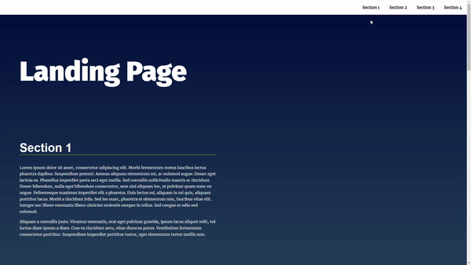

# Landing Page Project

This project uses the basic browser API to make interacting with the website more enjoyable.
All section are build dynamically, with a dynamically updating navigational menu based on the amount of content that is added to the page.

# Demo-Preview

You can view a live demo at [Vercel deployment platform](https://landing-page-kappa-ruddy.vercel.app/).

# Usage

Just clone the project and open it in any modern browser.
